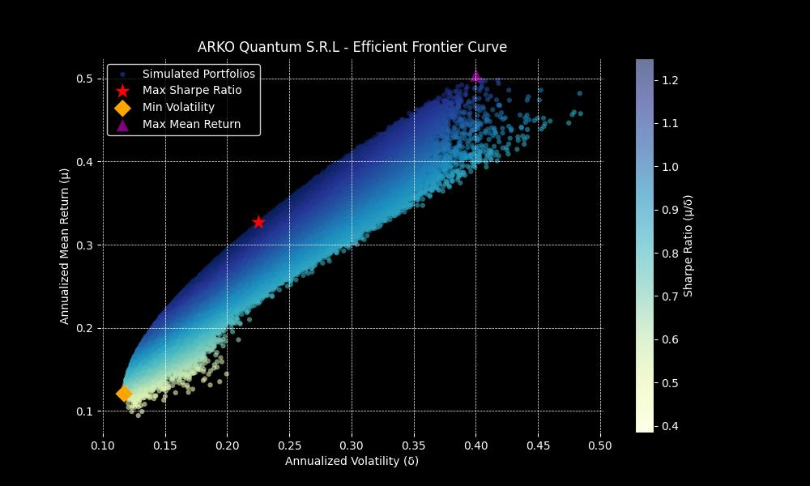

# Modern Portfolio Theory Engine

The **Modern Portfolio Theory Engine** is a Python-based analytical tool that applies Monte Carlo simulation to evaluate portfolio allocation strategies. Users provide a list of asset ticker symbols, and the engine generates thousands of randomized portfolios, assessing each for expected return, volatility, and Sharpe ratio. Results are visualized through an efficient frontier plot, with optimal portfolios clearly identified.

---

## Features

- Monte Carlo simulation across thousands of portfolio combinations  
- Calculation of expected annual return, portfolio volatility, and Sharpe ratio  
- Identification and visualization of:
  - Maximum Sharpe ratio portfolio  
  - Minimum volatility portfolio  
  - Maximum return portfolio  
- Efficient frontier plotting for visual analysis  
- Modular and extensible architecture

---

## Platform Support

The Modern Portfolio Theory Engine is cross-platform and supports:

- Windows (Windows 10 and above)  
- macOS (macOS 11 and above)  
- Linux (Ubuntu 20.04+, Debian-based, Arch-based, etc.)

---

## Installation

### Prerequisites

- Python 3.7 or later  
- Git (optional, for cloning)

Check Python version:

```bash
python --version
```

or

```bash
python3 --version
```

### Installation Steps

#### 1. Clone the Repository

```bash
git clone https://github.com/yourusername/modern-portfolio-theory-engine.git
```

#### 2. Create a Virtual Environment (Recommended)

**Windows:**

```cmd
python -m venv venv
venv\Scripts\activate
```

**macOS/Linux:**

```bash
python3 -m venv venv
source venv/bin/activate
```

#### 3. Install Packages

```bash
pip install -r packages.txt
```

---

## Required Packages

- `numpy`  
- `pandas`  
- `matplotlib`  
- `yfinance`

All required packages are listed in `packages.txt`.

---

## Usage Example

### Portfolio Summary

### Setup and Asset Selection
The user is prompted to enter a number of desired assets, random weight simulations, and the ticker for each asset to be included in the portfolios.

.jpg)

### Data Collection and Summary
The program automatically pulls historical data from Yahoo Finance for the selected assets, making sure to only start from the most recent common date shared acrooss the basket. It is important to only use instruments listed in Yahoo Finance and enter the tickers exactly as they appear in the site. Otherwise, the engine will not work properly. The three main portfolios, maximum Sharpe, maximum mean return, and minimum volatility will be displayed in the console with their respective performance metrics and weights.

.jpg)

### Efficient Frontier Visualization
Finally, a separate window graphs the portfolios efficient frontier curve, detailing the entire range of simulations and highlighting the most relevant.



---

## License

This project is licensed under the **GNU General Public License v3.0 (GPL-3.0)**. See the [LICENSE](LICENSE) file for details.
